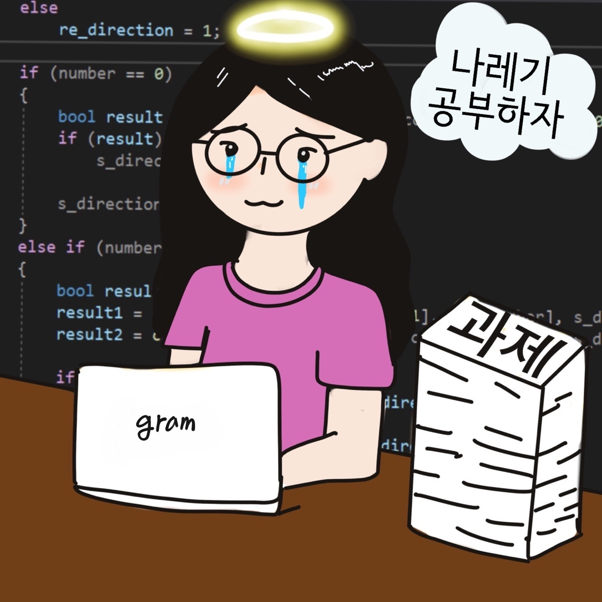

# INNOVATION HACKATHON 자기소개   

### [개발자] 김혜근    

---

#### 1. 한 줄로 알아보기

- 소프트웨어공학과 19학번 김혜근
- 아직 부족하지만 인공지능에 관심이 있어 연구실에서 공부하고 있습니다. 

#### 2. 나의 좌우명

- 포기하기 전에 다시 한 번 해보자.     

#### 3. 나의 MBTI

- INTP
- 처음에는 낯을 많이 가리지만 친해지면 ~~미친X~~처럼 잘 논다.

#### 4. 앞으로 새로 공부해보고 싶은 분야

- ** 컴퓨터비전**을 열심히 공부해 보고 싶습니다. 
- 웹, 앱 개발을 조금 공부했었는데 이번에는 인공지능과 결합하여 만들어보고 싶습니다. 
